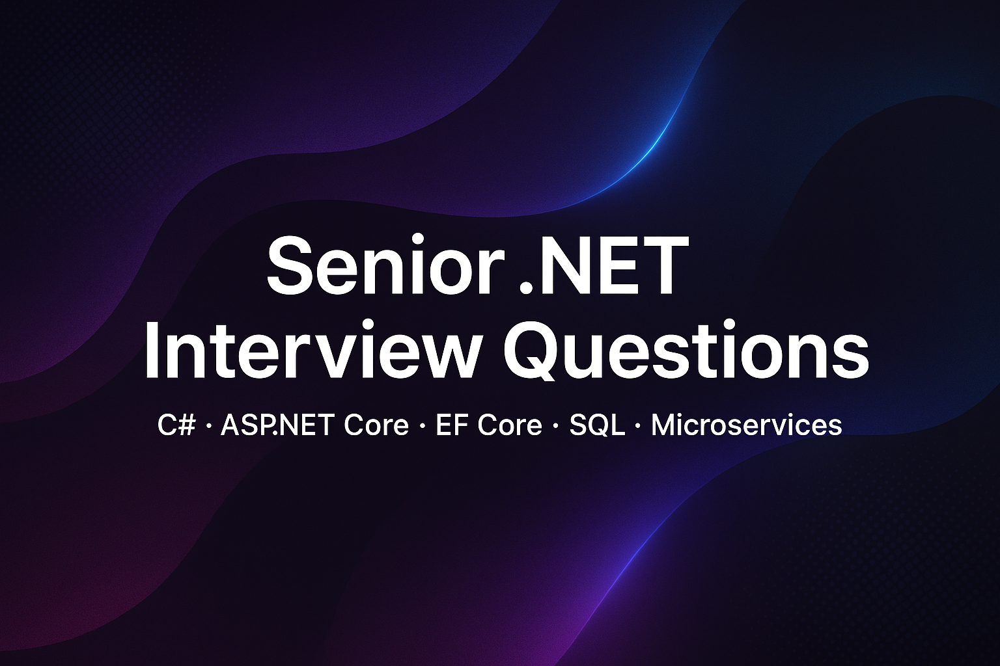

  

# Senior .NET Backend Interview Questions

This repository contains a comprehensive collection of **.NET backend interview questions** focused on **senior developer** roles.  
It includes questions on **C#, ASP.NET Core, Entity Framework Core, SQL Server, Microservices, Clean Architecture, CQRS, DDD, Security, Testing, and System Design**.  

The goal is to provide a **complete reference** for preparing for **senior .NET interviews** – from language fundamentals to advanced architecture and real-world problem solving.

